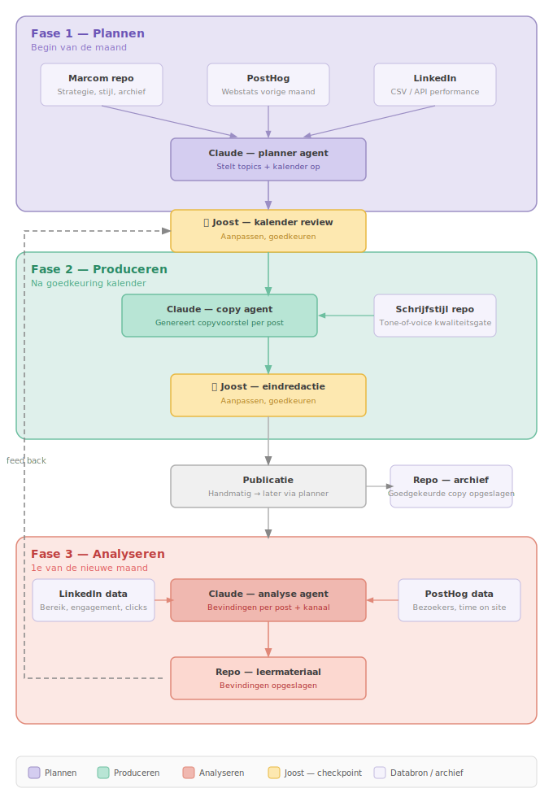

# radicle-marcom

Centrale database voor marketing, communicatie en content van Radicle Ventures. Archief én fundament voor AI-native marcom.

## Architectuur

## Wat staat hier

| Map | Inhoud |
|-----|--------|
| `contentstrategie/` | Redactionele kaders, thema's, contentkalender |
| `linkedin/` | Copy voor posts, campagnes en reacties |
| `slides/` | Workshop decks en presentaties |
| `social/` | Templates voor social media per platform |
| `design/` | Visuele assets, richtlijnen, templates |

## Schrijfomgeving

Drafts worden geschreven en geredigeerd in Notion:
**[Radicle Marcom — Notion workspace](https://www.notion.so/360a2b8d1769816198bedae2e0ecd7b6)**

De copy agent schrijft drafts direct in Notion. Joost keurt goed via de statusflow: Gepland → Draft → Eindredactie → Goedgekeurd → Gepubliceerd.

## Samenhang met andere repos

- **Tone-of-voice & schrijfstijl** → [`radicle-ventures/replicate-my-writing-style`](https://github.com/radicle-ventures/replicate-my-writing-style) — kwaliteitsgate voor AI-drafts die klinken als Joost Marsman
- **Competitor analysis** → [`radicle-ventures/radicle-website`](https://github.com/radicle-ventures/radicle-website/blob/main/research/competitor-analysis.md) — analyse van AI workshop aanbieders in NL/EU vanuit gedragsmatig perspectief
- **Buyer research** → [`radicle-ventures/radicle-website`](https://github.com/radicle-ventures/radicle-website/blob/main/research/incompany-buyer-perspective.md) — POV en marktcontext van in-company kopers in Nederlandse corporate L&D

## Hoe te gebruiken

Deze repo is een intern archief. Materiaal hier dient als:

1. **Bronmateriaal** voor nieuwe content — zoek op wat er al is voor je iets nieuws maakt
2. **AI-context** — geef Claude (of een ander model) bestanden uit deze repo mee als context bij het genereren van marcom
3. **Kwaliteitsreferentie** — bestaande goedgekeurde copy als benchmark voor nieuwe output

## Bijdragen

Alleen intern gebruik. Voeg materiaal toe via een PR met een korte omschrijving van wat het is en voor welk kanaal of doel het bedoeld was.
